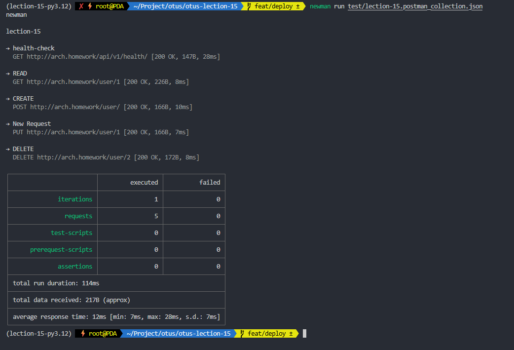
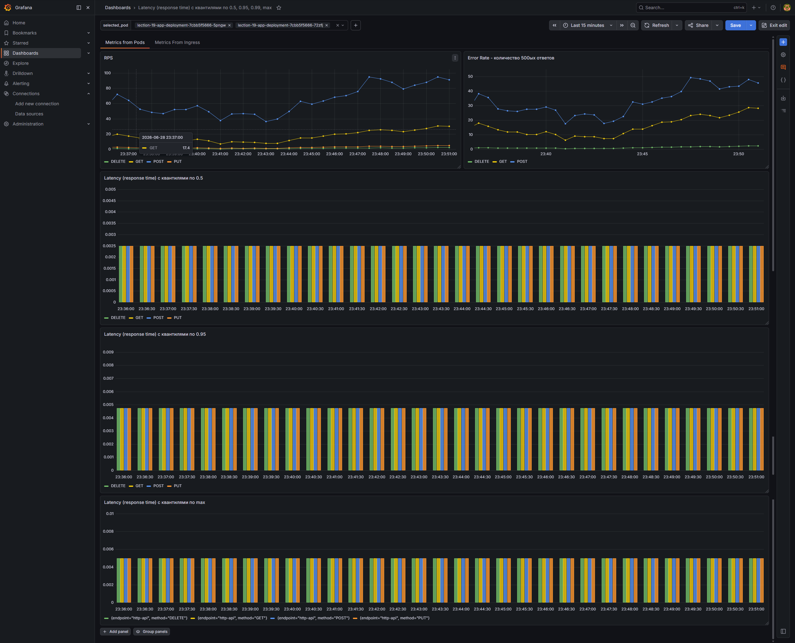
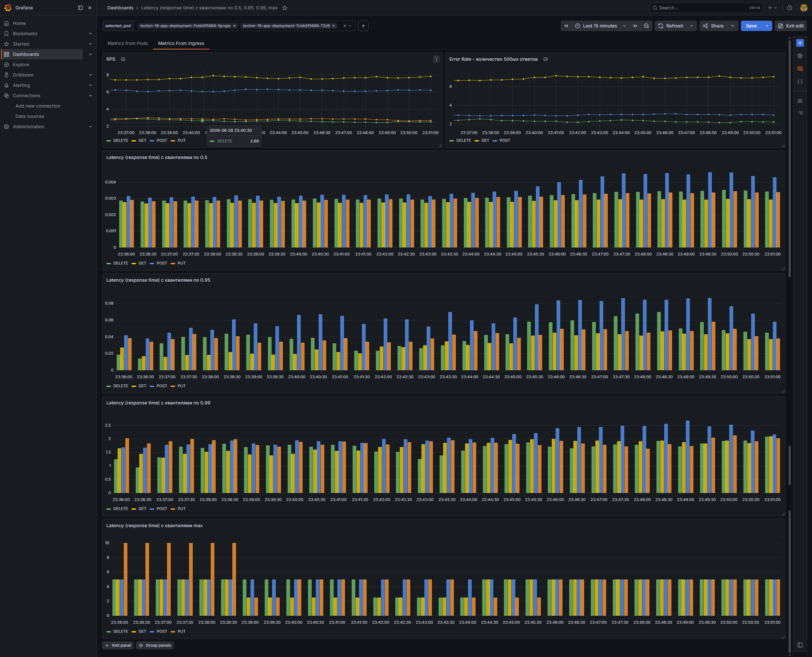
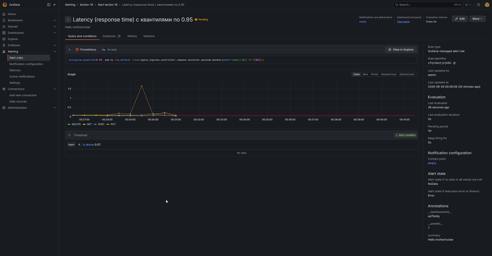
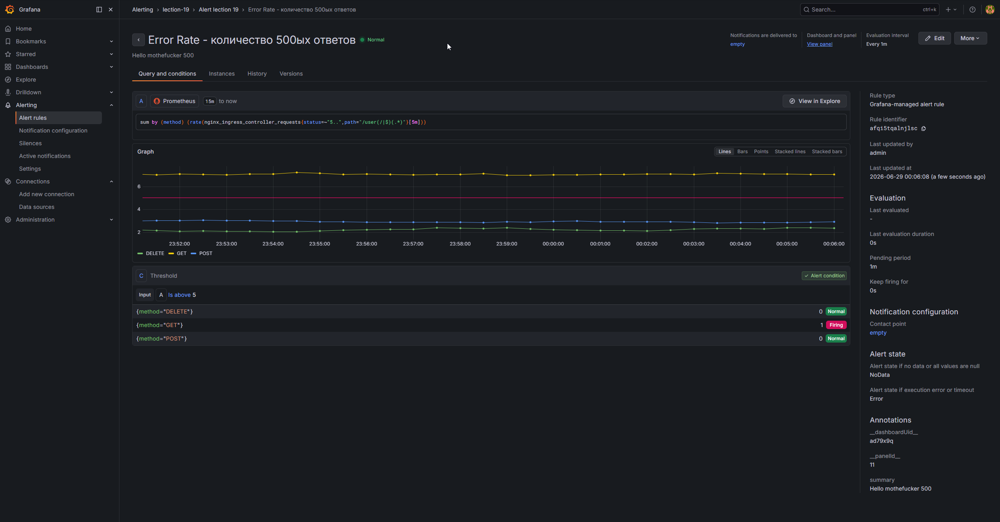
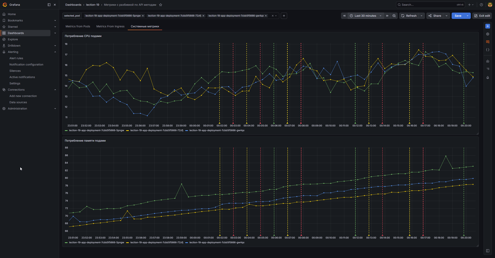

# Домашнее задание

Инструментировать сервис из прошлого задания метриками в формате Prometheus с помощью библиотеки для вашего фреймворка и ЯП.

## Вариант 1 (С КОДОМ)

Сделать дашборд в Графане, в котором были бы метрики с разбивкой по API методам:

1. Latency (response time) с квантилями по 0.5, 0.95, 0.99, max
2. RPS
3. Error Rate - количество 500ых ответов

Добавить в дашборд графики с метрикам в целом по сервису, взятые с nginx-ingress-controller:

1. Latency (response time) с квантилями по 0.5, 0.95, 0.99, max
2. RPS
3. Error Rate - количество 500ых ответов

Настроить алертинг в графане на Error Rate и Latency.


На выходе должно быть:
0) скриншоты дашборды с графиками в момент стресс-тестирования сервиса. Например, после 5-10 минут нагрузки.
1) json-дашборды.


Задание со звездочкой

Используя существующие системные метрики из кубернетеса, добавить на дашборд графики с метриками:

Потребление подами приложения памяти
Потребление подами приолжения CPU

Инструментировать базу данных с помощью экспортера для prometheus для этой БД.

Добавить в общий дашборд графики с метриками работы БД.


## Вариант 2 (БЕЗ КОДА)

Подготовить постановку задачи для DevOps.
Предложить 2-3 варианта бизнес-метрик мониторинга, а также технических метрик мониторинга, которые должны будут обеспечить наблюдаемость за системой в процессе ее эксплуатации.

Критерии оценки:
"Принято" - один из вариантов задания выполнен полностью (оба варианта выполнять не требуется)
"Возвращено на доработку" - задание не выполнено полностью


## Чек-лист

- [x] Подготовка приложения (RESTful CRUD)
- [x] Установить БД в кластер Kubernetes с помощью стабильного Helm-чарта
- [x] Секреты и ConfigMap
- [x] Job для миграций
- [x] Deployment и Service приложения
- [x] Ingress
- [x] Порядок применения манифестов
- [x] Postman коллекция и тестирование
- [x] Задание со звездочкой (Helm-чарт для приложения)
- [x] Реализовать middleware сбора метрик
- [x] Настроить сбор метрик из pod-ов
- [x] Настроить сбор метрик из ingress-а
- [x] Поднять под с нагрузочным тестом, сконфигурировать его
- [x] Сделать дашборд Grafana Latency (response time) с квантилями по 0.5, 0.95, 0.99, max
- [x] Сделать дашборд Grafana RPS
- [x] Сделать дашборд Grafana Error Rate - количество 500ых ответов
- [x] Добавить в дашборд графики с метрикам в целом по сервису, взятые с nginx-ingress-controller: Latency (response time) с квантилями по 0.5, 0.95, 0.99, max
- [x] Добавить в дашборд графики с метрикам в целом по сервису, взятые с nginx-ingress-controller: RPS
- [x] Добавить в дашборд графики с метрикам в целом по сервису, взятые с nginx-ingress-controller: Error Rate - количество 500ых ответов
- [x] Настроить алертинг в графане на Error Rate и Latency.
- [x] Добавить в дашборд графики с системными метриками подов
- [ ] Добавить в общий дашборд графики с метриками работы БД.


## Порядок применения манифестов


Порядок скорректирован через helm хуки

```shell
helm install postgres-database oci://registry-1.docker.io/bitnamicharts/postgresql -f ./.helm/values/postgres-values.yaml

helm repo add ingress-nginx https://kubernetes.github.io/ingress-nginx/ && helm repo update && helm install nginx ingress-nginx/ingress-nginx -f .helm/values/nginx-ingress.yaml

minikube image build -t lection-19-app:0.0.1 .

helm upgrade nginx ingress-nginx/ingress-nginx \
  --reuse-values \
  --set controller.metrics.enabled=true \
  --set controller.metrics.serviceMonitor.enabled=true \
  --set controller.metrics.serviceMonitor.additionalLabels.release="prometheus-stack"


helm install lection-19-release ./.helm -f ./.helm/values.yaml
kubectl apply -f .helm/templates/service-monitor.yaml

minikube tunnel

echo "127.0.0.1 arch.homework" >> /etc/hosts

Добавить в C:\Windows\System32\drivers\etc\hosts  127.0.0.1 arch.homework

kubectl port-forward service/prometheus-kube-prometheus-prometheus 9090:9090

kubectl port-forward service/prometheus-grafana 9090:80

```

## Тестирование

Запуск нагрузочно тестирования при помощи locust
```shell
locust -f test/load_test.py --host=http://localhost:8000
```


```shell
newman run test/lection-19.postman_collection.json
```




## Результаты

Итоговый [json-dashboard](dashboards/target-dashboard.json)


### Дашборд метрик из приложения




### Дашборд метрик из ingress-controller-а




### Алерты





## Системные метрики




# Источники

- https://github.com/vadim-perepelkin/monitoring-demo/blob/main/monitorable-application/k8s/service-monitor.yaml
- https://github.com/prometheus/client_python
- https://prometheus.io/docs/prometheus/latest/getting_started/
- https://prometheus.github.io/client_python/instrumenting/counter/